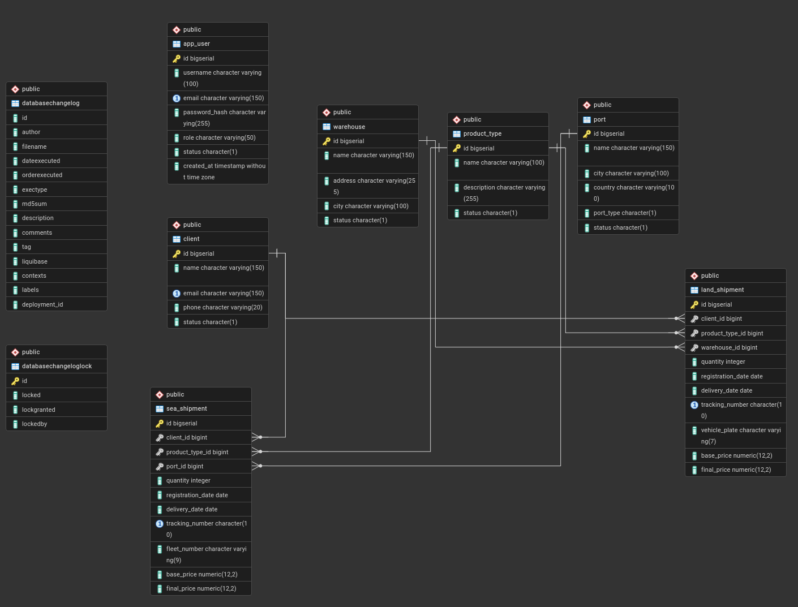

# Logistics API

Prueba técnica — Desarrollador de Software Semi-Senior / Senior

## Repositorio

[https://github.com/jhonEdisonVargas96/logistics/tree/main](https://github.com/jhonEdisonVargas96/logistics/tree/main)

---

## Modelo de base de datos

> Guardarlo en: `src/main/resources/docs/db-model.png`

```
src/main/resources/
└── docs/
    └── db-model.png   ← exportar desde pgAdmin: clic derecho en la BD → ERD Tool → File → Save as PNG
```



---

## Stack tecnológico

| Tecnología     | Versión                      |
|----------------|------------------------------|
| Java           | 21                           |
| Spring Boot    | 3.4+                         |
| Gradle         | 9                            |
| PostgreSQL     | 16                           |
| Liquibase      | —                            |
| Arquitectura   | Hexagonal (Ports & Adapters) |

---

## Dependencias

```gradle
dependencies {
    // Spring
    implementation 'org.springframework.boot:spring-boot-starter-actuator'
    implementation 'org.springframework.boot:spring-boot-starter-validation'
    implementation 'org.springframework.boot:spring-boot-starter-web'

    // Lombok
    compileOnly 'org.projectlombok:lombok'
    annotationProcessor 'org.projectlombok:lombok'

    // Security
    implementation 'org.springframework.boot:spring-boot-starter-security'
    implementation 'com.nimbusds:nimbus-jose-jwt:10.5'
    implementation 'io.jsonwebtoken:jjwt-api:0.13.0'
    implementation 'io.jsonwebtoken:jjwt-impl:0.13.0'
    implementation 'io.jsonwebtoken:jjwt-jackson:0.13.0'

    // Jackson
    implementation 'com.fasterxml.jackson.datatype:jackson-datatype-jsr310'

    // DB
    implementation 'org.springframework.boot:spring-boot-starter-jdbc'
    implementation 'org.springframework.boot:spring-boot-starter-liquibase'
    runtimeOnly 'org.postgresql:postgresql'

    // Test
    testImplementation 'org.springframework.boot:spring-boot-starter-actuator-test'
    testImplementation 'org.springframework.boot:spring-boot-starter-jdbc-test'
    testImplementation 'org.springframework.boot:spring-boot-starter-liquibase-test'
    testImplementation 'org.springframework.boot:spring-boot-starter-security-test'
    testImplementation 'org.springframework.boot:spring-boot-starter-validation-test'
    testImplementation 'org.springframework.boot:spring-boot-starter-webmvc-test'
    testRuntimeOnly 'org.junit.platform:junit-platform-launcher'
}
```

---

## Configuración local

### 1. Requisitos previos

- Java 21
- Docker o Podman
- PostgreSQL 16 (o usar el compose incluido)

### 2. Base de datos con Podman

```bash
podman-compose up -d
```

### 3. Crear la base de datos

```bash
podman exec -it postgres-dev psql -U dev -c "CREATE DATABASE sinergia;"
```

### 4. Variables de entorno (opcional)

Crea `src/main/resources/application-dev.yml` con tus credenciales locales (este archivo está en `.gitignore`):

```yaml
spring:
  datasource:
    url: jdbc:postgresql://localhost:5432/sinergia
    username: dev
    password: dev123

jwt:
  secret: tu-clave-secreta-aqui
```

### 5. Ejecutar la aplicación

```bash
./gradlew bootRun --args='--spring.profiles.active=dev'
```

Liquibase crea las tablas automáticamente al arrancar.

---

## Colección Postman

Importar desde: `src/main/resources/collection/collection.json`

### Endpoints disponibles

| Método | URL | Auth |
|--------|-----|------|
| POST | `/api/v1/auth/register` | No |
| POST | `/api/v1/auth/login` | No |
| GET / POST / PUT / DELETE | `/api/v1/clients/**` | Bearer |
| GET / POST / PUT / DELETE | `/api/v1/product-types/**` | Bearer |
| GET / POST / PUT / DELETE | `/api/v1/warehouses/**` | Bearer |
| GET / POST / PUT / DELETE | `/api/v1/ports/**` | Bearer |
| GET / POST / PUT / DELETE | `/api/v1/land-shipments/**` | Bearer |
| GET / POST / PUT / DELETE | `/api/v1/sea-shipments/**` | Bearer |

> El endpoint de login guarda el token automáticamente en la variable `{{token}}` de la colección.

---

## Pruebas unitarias

```bash
./gradlew test
```

Reporte: `build/reports/tests/test/index.html`

Cobertura de pruebas:

- `LandShipmentServiceImplTest` — lógica de negocio, descuento 5%, validaciones FK
- `SeaShipmentServiceImplTest` — lógica de negocio, descuento 3%, validaciones FK
- `ClientServiceImplTest` — CRUD, email duplicado
- `JwtServiceTest` — generación, validación y extracción de claims del token

---

## Preguntas teóricas

### ¿Cómo implementarías la arquitectura hexagonal en Spring Boot y cuáles son sus beneficios?

La implementaría creando los tres paquetes principales: `application`, `domain` e `infrastructure`. Esto permite que el dominio no dependa de bases de datos, APIs o frameworks externos.

**Beneficios:** bajo acoplamiento, fácil cambio de tecnologías y mejor mantenibilidad.

---

### Explique cómo funciona la inyección de dependencias en Spring y las diferencias entre sus modos.

Spring crea y gestiona los beans y los inyecta donde se necesiten. Los tres modos son:

- **Constructor injection:** dependencias obligatorias. Es la más recomendada porque facilita pruebas, mantiene objetos inmutables y garantiza que las dependencias estén disponibles desde la creación del objeto.
- **Setter injection:** para dependencias opcionales.
- **Field injection:** directamente en el atributo con `@Autowired`. No recomendada porque dificulta las pruebas unitarias.

---

### ¿Cómo configurarías perfiles en Spring Boot para distintos entornos?

Usando archivos separados por entorno:

```
application.yml          → configuración base (va al repositorio)
application-dev.yml      → desarrollo local (ignorado en .gitignore)
application-example.yml  → plantilla de referencia (va al repositorio)
```

Se activan con `spring.profiles.active=dev` o al ejecutar la aplicación con el argumento correspondiente. Permiten cambiar configuraciones de base de datos, logs o servicios externos según el entorno.

---

### Explique cómo se puede utilizar Spring Boot Actuator para monitorear una aplicación en producción.

Actuator expone endpoints HTTP para monitorear y administrar la aplicación:

| Endpoint | Descripción |
|----------|-------------|
| `/actuator/health` | Estado de la aplicación |
| `/actuator/metrics` | Métricas de rendimiento |
| `/actuator/info` | Información de la aplicación |
| `/actuator/env` | Variables de entorno activas |

Permite monitorear CPU, memoria, peticiones HTTP y estado de conexiones a base de datos.

---

### Explique qué es JPA y para qué sirven las anotaciones principales.

JPA (Java Persistence API) es una especificación para mapear objetos Java a tablas de base de datos usando ORM.

| Anotación | Uso |
|-----------|-----|
| `@Entity` | Define una clase como entidad persistente |
| `@Id` | Marca el campo como clave primaria |
| `@GeneratedValue` | Genera el valor del ID automáticamente |
| `@Table` | Define el nombre de la tabla en BD |
| `@OneToMany` | Relación uno a muchos |
| `@ManyToOne` | Relación muchos a uno |

> En este proyecto se utilizó **JDBC** con consultas manuales en lugar de JPA, por preferencia del enfoque y control sobre las queries.

---

### ¿Cómo funciona `@Transactional` en JPA?

`@Transactional` maneja transacciones de base de datos. Garantiza que un conjunto de operaciones se ejecute como una sola unidad atómica:

- Si todas las operaciones tienen éxito → **commit**
- Si ocurre un error → **rollback**

Esto evita inconsistencias en los datos cuando múltiples operaciones dependen entre sí.

---

### Describe cómo implementar lazy loading en Angular y sus beneficios.

Lazy loading permite cargar módulos solo cuando el usuario los necesita, en lugar de cargar toda la aplicación al inicio.

**Beneficios:**
- Reduce el tiempo de carga inicial
- Mejora el rendimiento general
- Escala mejor en aplicaciones grandes

---

### ¿Cómo optimizarías el rendimiento de una aplicación Angular grande?

| Técnica | Descripción |
|---------|-------------|
| Lazy loading | Carga módulos bajo demanda |
| `ChangeDetectionStrategy.OnPush` | Reduce detección de cambios innecesaria |
| `trackBy` en `*ngFor` | Evita re-renderizado completo de listas |
| `async` pipe | Manejo automático de suscripciones |
| Build de producción | `ng build --configuration production` |

Estas técnicas combinadas reducen renderizados innecesarios y mejoran la experiencia del usuario en aplicaciones de gran escala.